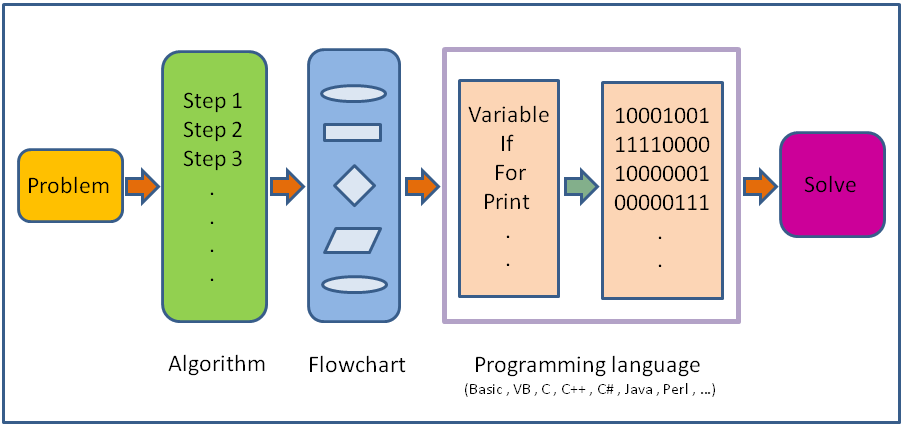

# C++ Programming

- [C++ Programming](#c-programming)
- [Chapter 1: Getting started with C++](#chapter-1-getting-started-with-c)
  - [1.1: Features](#11-features)
  - [1.2: Advantage](#12-advantage)
  - [1.3: Uses](#13-uses)
  - [1.4: Execution](#14-execution)
  - [1.5: IDE](#15-ide)
  - [1.6: First Program](#16-first-program)
- [Chapter 2. Basics](#chapter-2-basics)
  - [2.1. Constant](#21-constant)
  - [2.2. Datatype](#22-datatype)
  - [2.3. Variable](#23-variable)
  - [2.4. Comments](#24-comments)
  - [3. Input and Output](#3-input-and-output)


# Chapter 1: Getting started with C++

- C++ is a general purpose programming language used for creating computer programs.
- C++ was created by __Bjarne Stroustrup__ in 1979.
- It also called as __C with classes__.
- C has limitations.
- In 1983 renamed as "C++".
- `++` is referred as increment operator.



## 1.1: Features

- General purpose programming language used to writing a wide variety of application softwares.
- Middle level programming language.
- Compiled Language.
- Object oriented programming language.
  - Procedural Programming.
  - Object Oriented Programming.
  - Generic Programming.
  - Functional Programming.
- C++ is a general purpose middle level compiled object oriented programming language.

## 1.2: Advantage

- Efficient language.
- Reliable and fast.
- Better understanding of OOP.
- Learning other language will be easy Java, C# etc.

## 1.3: Uses

- used to creating games.
- GUI Applications.
- Web Browser ex: Mozilla Firefox.
- used to creating compilers.
- operating systems.
- Medical and Engineering applications.
- For creating other programming languages ex: Java.

## 1.4: Execution

- File Extension: `.txt`, `mp3`, `pdf`.
- Source Code C++: `.cpp`, `.cc`, `.cxx`, `.cp`, `.c`.
- Header Files Extension: `.h`, `.hpp`.
- __GCC:__ GNU Compile Collection.

## 1.5: IDE

- Toolset/Toolchain is a bunch of programs helps us to translate programs into executable code.
- __Compilers :__ GNU c++ compiler.
  - mingw: minimalist GNU for windows.
  - cygwin: for Linux.
- __IDE:__ Code Blocks, Eclipse, Visual Studio Code, Turbo C++.

## 1.6: First Program

```cpp
#include <iostream>
using namespace std;

int main()
{
  cout<<"Hello World!";
  return 0;
}
```

__See program [first-program.cpp](programs/1-first-program.cpp)__

__Explanation :__

- __Preprocessor Directive:__ `#include` allows to include library and header files.
- __<iostream>__ : allows to do Ip/Op task.
- __<<__ : is stream insertion operator.

__Include cstdlib library:__

```cpp
#include <iostream>
#include <cstdlib>
using namespace std;

int main()
{
    cout<<"including cstdlib library";
    system("PAUSE");
        // It pause the program after completing execution.
    return 0;
}
```

__See program [2-include-cstdlib.cpp](programs/2-include-cstdlib.cpp)__

# Chapter 2. Basics

## 2.1. Constant

- It is an entity which does not change.
- Ex: Integer : 44, 54
  - Float : 12.4, 434.280
  - Character : 'a', 'b', ''z
  - String : "Chris"
  - Boolean : true, false.
  - Void : null.

## 2.2. Datatype

- int, char, float, bool, void.
- __Type Modifiers :__ sign, unsigned, short, long.


## 2.3. Variable

__Address :__
- 8 bit = 1 Byte
- address: `234556` unique referred as variable (x) name for convenient.

|0|1|0|1|1|1|0|0|-|-|-|-|-|
|---|---|---|---|---|---|---|--|---|---|---|---|---|

__Variable Declaration:__
```cpp
#include <iostream>
using namespace std;

int main()
{
    // Declaration of variables
    int age;
    float average;
    char sex;
    bool isit;
    // If you don't initialize then it contains Garbage values.
    cout<<age<<endl<<average<<endl<<sex<<endl<<isit;
    return 0;
}
```
- __See program [4-variables.cpp](programs/4-variables.cpp)__

__Declaration with Initialization:__
```cpp
#include <iostream>
using namespace std;

int main()
{
    // Declaration with initialization
    int age = 23;
    char sex = 'M';
    bool isit = true;       // return value as 1
    
    cout<<age<<endl<<sex<<endl<<isit<<endl;
    
    float average;
    // Initialization
    average = 76.3;
    cout<<average;
    return 0;
}
```
- __See progarm [5-initialization](programs/5-initialization.cpp)__

__Bunch of Declaration:__
```cpp
#include <iostream>
using namespace std;

int main()
{
    // Bunch of declaration
    int a, b, c, d;
    float e, f = 34.2, g;
    cout<<f<<endl;
    return 0;
}
```
- __See program [6-bunch-of-declaration.cpp](programs/6-bunch-of-declaration.cpp)__

__Type Modifiers:__
```cpp
#include <iostream>
using namespace std;

int main()
{
    // Type modifiers
    short int people=2343563;
    cout<<people;
}
```


## 2.4. Comments

- Compiler ignores comments.
- written:
  - `//` for single line comment.
  - `/* */` for multiple line comment.

```cpp
#include <iostream>
using namespace std;
int main()
{
    /*
    This is multi line comment.
    endl is used to end the line with new line.
    */
    cout<<"There are 2 types of comments are available"<<endl;
    // This is single line comment.
    cout<<"comments helps to human readers.";
    return 0;
}
```
__See program [3-comments.cpp](programs/3-comments.cpp)__

## 3. Input and Output


